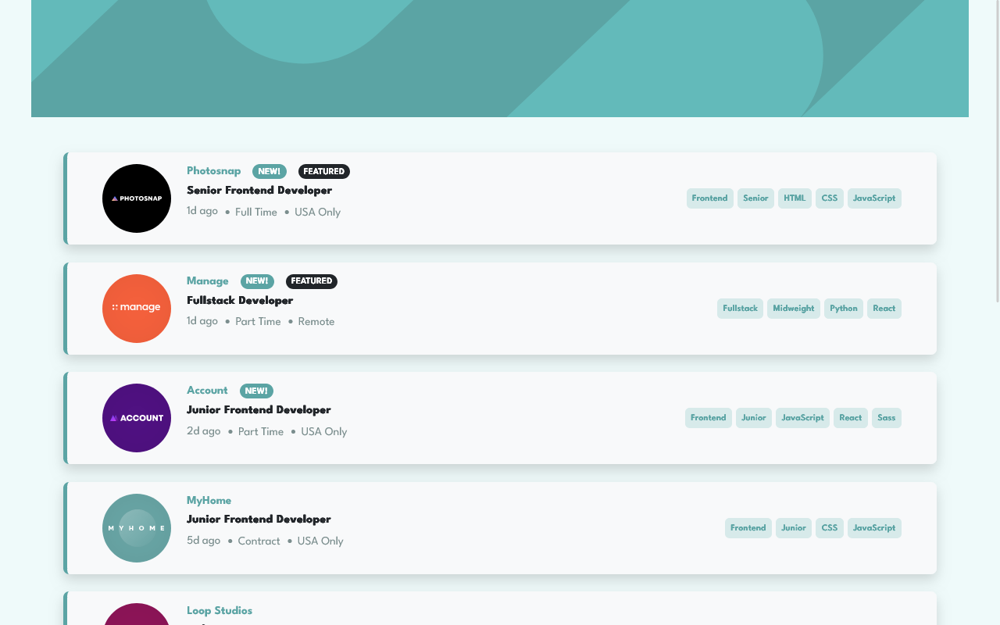

# Frontend Mentor - Job listings with filtering solution

This is a solution to the [Job listings with filtering challenge on Frontend Mentor](https://www.frontendmentor.io/challenges/job-listings-with-filtering-ivstIPCt). Frontend Mentor challenges help you improve your coding skills by building realistic projects. 

## Table of contents

- [Overview](#overview)
  - [The challenge](#the-challenge)
  - [Screenshot](#screenshot)
  - [Links](#links)
- [My process](#my-process)
  - [Built with](#built-with)
  - [Challenge i encountered](#challenge-i-encountered)
  - [What I learned](#what-i-learned)
- [Author](#author)

## Overview

### The challenge

Users should be able to:

- View the optimal layout for the site depending on their device's screen size
- See hover states for all interactive elements on the page
- Filter job listings based on the categories

### Screenshot




### Links

- Solution URL: (https://github.com/Dee-Maria/react-static-job-listings)
- Live Site URL: (https://react-static-job-listings-phi.vercel.app/)

## My process

### Built with

- Semantic HTML5 markup
- CSS custom properties
- Flexbox
- [React](https://reactjs.org/) - JS library
- Bootstrap

### Challenge i encountered

I encountered a challenge which actually has given me more insight to while the useEffect() was created in react. Opening 
my , you will notice the filterate which is an array, and that is what
displays on our filter container or niche container, the data or the specific data we are looking for. After the creation 
of the filtration function which adds the specific data we are looking for, I also had to filter the data we already
have so as to match the data we inputed calling the setEmployees() function immediately after the setFilterate() function
and nothing gets displayed even if the data required is being added to the filterate array. Took me some time to figure this out.

### What I learned

Prior I talked about the challenged I encountered, saying I called the setEmployees() function immediately after the 
setFilterate() function which updates the state of the filterate, this was what it looked like.
```js
const filtration = (e) => {
  let filterItem = e.currentTarget.textContent;
  if(filterate.includes(filterItem)) {
    return;
  } else {
    setFilterate(prev => [...prev, filterItem]); // updating filtrate state
    // console.log(filterate);
    setEmployees(prev => {
      let newEmployees = data.map(singledata => {
        // the logic looking at filterate state
      })
      return newEmployees;
    })
  }
}
```
I commented the *console.log(filterate)*, logging filterate, you will notice that it gives you the previous value of filterate, 
even after updating filterate state. And this spiked some frustration and I had to leave the project for a while.
Well after doing little findings, I stumbled upon a single sentence which says *Old state still exist even after updating state*.
And that sentence alone, made me notice something ***REMEMBER I SAID EVEN AFTER UPDATING FILTERATE STATE***. What does useEffect() do ???
Using this hook tells react that your component will do something after render. React will remember this function you passed
which we refer to as effect and call it later after performing the DOM updates.
So now my code looks like this
```js
useEffect(() => {
  if(filterate.length < 1) {
      setEmployees(prev => data);
  } else {
    let  newEmployees = data.map(singledata => {
      // all the login needed to sieve data
    }) 
    setEmployees(newEmployees); // setting data to the new filtered values
}
}, [filterate]) // filterate being the dependeny: useEffect any time filterate is updated
```

## Author

- LinkedIn - [Sopuruchukwu Ofurum](https://www.linkedin.com/in/josemaria-ofurum-07b878201/)
- Frontend Mentor - [@Da-Hubb](https://www.frontendmentor.io/profile/Da-Hubb)